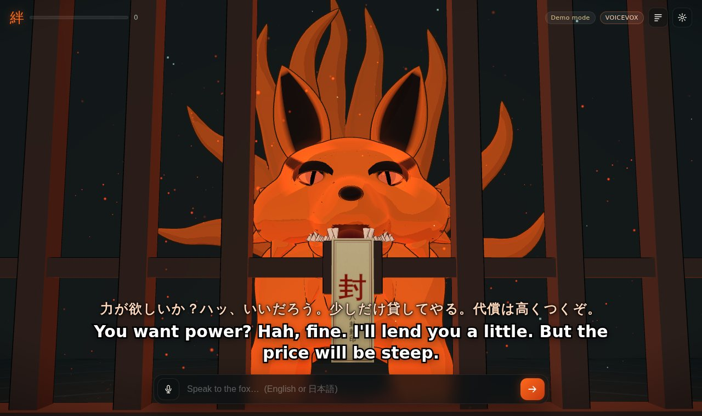
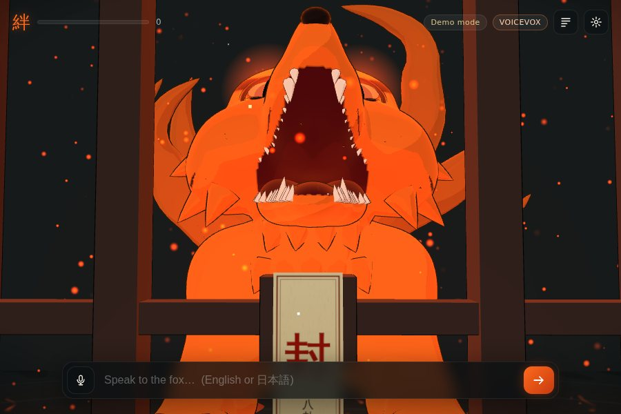
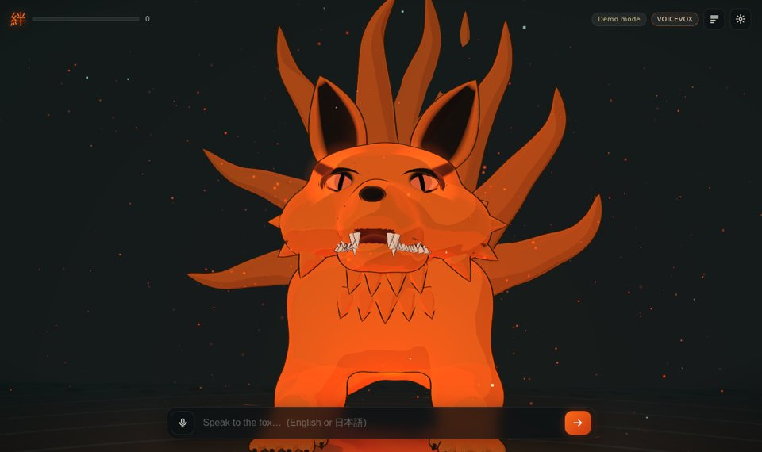

# 九喇嘛 Kurama: talk to the Nine-Tailed Fox sealed inside you

An interactive fan project. You walk into your own mindscape as Kurama's jinchūriki: a flooded corridor that ends at a huge cage sealed with a 封 tag. You talk to him by typing or with your microphone. He answers **out loud in Japanese** in a deep, rough beast voice, with **English (and Japanese) subtitles**. He is a cel-shaded 3D model that is **built, rigged and animated in Blender**. He lip-syncs every syllable, blinks, follows you with his eyes, flattens his ears when he's angry, laughs, roars at the bars and dozes off if you ignore him.



| Roar | Partner era (the cage is gone) | The Blender scene |
|---|---|---|
|  |  |  |

## What's inside

| Part | What it does |
|---|---|
| `blender/build_kurama.py` | Builds all of Kurama from code in Blender: the body, the head, a hinged jaw with teeth and tongue, eyes with slit pupils, eyelids, ears, **nine tails** and fur tufts. Also paints the markings, rigs 79 bones, skins the mesh and keys **14 animations**. Exports `web/assets/kurama.glb`, `web/assets/mindscape.glb` and `blender/kurama.blend`. |
| `blender/kurama.blend` | The finished scene: open it in Blender 4.2+ and press play. |
| `server/` | A tiny Node server. It gives Kurama his mind (Claude, replying in structured JSON) and his voice (VOICEVOX speech with a mora-accurate lip-sync timeline). It also has an offline demo mode. |
| `web/` | A three.js front end with cel shading and outlines, the cage, reflective water, chakra embers, animation blending and procedural facial animation. It runs the voice through an audio effects chain and shows subtitles, a log, settings and a microphone button. |

Animation clips: `Idle`, `Talk`, `Angry`, `Sleep` (loops) and `Laugh`, `Roar`, `Nod`, `HeadShake`, `LeanIn`, `LookAway`, `TailLash`, `Grin`, `Sigh`, `Wake` (one-shots). Claude picks an emotion and a gesture for every line.

## Quick start

You need **Node 18+**.

```bash
cd kurama
npm install
npm start            # → http://localhost:8787
```

That already works in **demo mode**, with canned replies and the browser's Japanese voice. For the full experience, add the brain and the voice.

### 1. The brain: Claude

```bash
cp .env.example .env
# edit .env and set ANTHROPIC_API_KEY=sk-ant-...
npm start
```

Kurama remembers the conversation (it's kept in your browser). He tracks a **bond** meter (絆) that slowly moves from contempt to grudging respect. He knows the Naruto world and stays in character. The default model is `claude-opus-5`, set in `.env` with `CLAUDE_MODEL`.

### 2. The voice: VOICEVOX (free Japanese TTS)

Run the VOICEVOX engine on its default port `127.0.0.1:50021`. Either of these works:

* Install the **VOICEVOX app** from <https://voicevox.hiroshiba.jp/> and keep it open. The engine runs while the app is open.
* Or use **Docker**: `docker run --rm -p '127.0.0.1:50021:50021' voicevox/voicevox_engine:cpu-latest`

Reload the page. The top-right chip changes to **VOICEVOX**. If the engine isn't running, the page falls back to your browser's Japanese voice with the pitch lowered as far as it goes. The mouth still moves in time with the speech in both cases.

### 3. Talk to him

* Type in English or 日本語, or press 🎤 and speak. The microphone works in Chrome, Edge and Safari; pick its language in Settings.
* **Settings** has:
  * your name
  * the era:
    * **Caged**: early, hostile Kurama behind the seal.
    * **Partner**: post-war, gruff tsundere; the cage disappears.
  * the subtitle mode (JA + EN / EN / JA)
  * the voice engine
  * **voice depth** and **demon layer** sliders
  * volume and ambience
* Leave him alone for two minutes and he falls asleep. Say something and he wakes up, one eye first.

## About the voice

Kurama's anime voice belongs to a real voice actor. This project **does not clone or imitate any real person's voice**. Instead, it takes VOICEVOX's deep male voice **青山龍星** and turns it into a monster in the browser:

1. **Emotion styles.** The emotion Claude picks chooses a VOICEVOX style: 不機嫌 when he's annoyed, 熱血 when furious, 囁き when sleepy, and so on.
2. **Pitch and formants.** The speech is synthesised slightly fast and played back slowed down. This lowers the pitch *and* the formants, so it sounds like a much bigger creature.
3. **Demon layer.** An octave-down copy is made with granular pitch shifting and mixed underneath.
4. **Growl.** A distorted, ring-modulated copy (about 38 Hz) adds rasp.
5. **Room.** Chest EQ, compression and a stone-chamber reverb finish it.

VOICEVOX's audio query gives the timing of every mora (a, i, u, e, o, ん, っ). The jaw follows that timing, scaled by the loudness of the processed audio. Browser speech has no timing data, so the lip-sync is estimated from the kana reading that Claude returns.

## Rebuilding / editing the model in Blender

Everything is procedural, so tweak the numbers and rebuild:

```bash
# with Blender 4.2+
blender --background --python blender/build_kurama.py -- --out web/assets --blend blender/kurama.blend
# or with the bpy module (Python 3.11): pip install bpy==4.2.0
python blender/build_kurama.py --out web/assets --blend blender/kurama.blend
# quick iteration (coarser meshes, no export):
python blender/build_kurama.py --fast --no-export --blend /tmp/k.blend
# still previews with Cycles:
python blender/render_previews.py --blend blender/kurama.blend --out previews --action Roar --frame 55
```

Where to change things in `build_kurama.py`:

* `LANDMARKS` and `L`: the pose and proportions.
* `HS`, `EYE_C`, `EAR_*`, `LIP_Z`: the head.
* `tail_curve()`: the tail fan.
* `eye_marking()`: the black markings.
* `build_animations()`: every clip.

In the `.blend`, each clip is a separate Action, also kept on its own muted NLA track. Assign one to the `Kurama` armature to preview it.

The web app relies on a few bone names (`head`, `neck`, `jaw`, `eye_L/R`, `lid_L/R`, `ear_L/R`) and on the material names (`KuramaFur`, `KuramaEye`, `KuramaPupil`, `KuramaTeeth`).

## How it works

```
 you ──text/mic──▶ web/js/main.js ──POST /api/chat──▶ server ──▶ Claude (persona + JSON schema)
                         │                     ◀── { ja, kana, en, emotion, gesture, bond_delta }
                         │──POST /api/tts──▶ server ──▶ VOICEVOX (audio_query → synthesis)
                         │                ◀── { wav, mora timeline }
                         ▼
   Web Audio beast chain ─▶ speakers        subtitles (JA/EN)
   lip-sync timeline + loudness ─▶ jaw      emotion ─▶ lids/ears/chakra   gesture ─▶ animation clip
```

## Configuration (`.env`)

| Variable | Default | Meaning |
|---|---|---|
| `ANTHROPIC_API_KEY` | none | Enables live conversation. Without it the server runs in demo mode. |
| `CLAUDE_MODEL` | `claude-opus-5` | The model that plays Kurama. |
| `VOICEVOX_URL` | `http://127.0.0.1:50021` | The VOICEVOX engine address. |
| `VOICEVOX_SPEAKER` | `青山龍星` | The base VOICEVOX character. |
| `VOICEVOX_STYLE_ID` | none | Forces one style id for every line. |
| `PORT` / `HOST` | `8787` / `127.0.0.1` | Where the server listens. Only use `HOST=0.0.0.0` if you mean to share it, because it spends your API credits. |
| `KURAMA_DEMO` | none | Set to `1` to force demo mode even with a key. |

Run the server's lip-sync unit tests with `node server/test_timeline.mjs`.

## Troubleshooting

* **Black screen or "Could not start WebGL".** Use a recent Chrome, Edge, Firefox or Safari with hardware acceleration turned on.
* **No sound.** The browser needs the click on *Enter the seal* before it will play audio. Check the Volume slider in Settings.
* **Chip says "Browser voice".** The VOICEVOX engine isn't reachable on `127.0.0.1:50021`. Start the app or the Docker container, then reload.
* **Chip says "Demo mode".** No API key was found. Add `ANTHROPIC_API_KEY` to `kurama/.env` and restart `npm start`.
* **Replies feel slow.** Each line is one Claude call plus one VOICEVOX synthesis. The VOICEVOX step takes about 2 seconds per sentence on a CPU. A GPU build of VOICEVOX is much faster.

## Credits

* A fan project for personal, non-commercial use. *Naruto* and Kurama © Masashi Kishimoto / Shueisha / TV Tokyo / Studio Pierrot. This project is not affiliated with or endorsed by any of them. The 3D model, the dialogue and the code are original.
* Voice: **VOICEVOX:青山龍星** (processed). Follow the [VOICEVOX](https://voicevox.hiroshiba.jp/) and character terms of use if you share any recordings.
* Built with [Blender](https://www.blender.org/), [three.js](https://threejs.org/) and [Claude](https://www.anthropic.com/claude).
